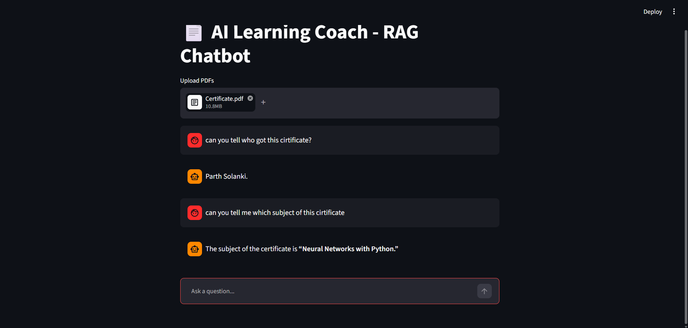

# AI Learning Coach – RAG Chatbot

<div align="center">

## 📸 Application Preview



</div>

---

# Project Overview

**AI Learning Coach – RAG Chatbot** is an intelligent document-based chatbot that enables users to upload one or more PDF documents and interact with them through natural language conversations.

Built using **LangChain**, **Groq LLM**, **HuggingFace Embeddings**, **Chroma Vector Database**, and **Streamlit**, the application retrieves the most relevant document chunks before generating responses. This Retrieval-Augmented Generation (RAG) approach significantly reduces hallucinations and ensures answers remain grounded in the uploaded documents.

The chatbot acts as a personalized AI learning assistant, making it easy to study books, research papers, notes, reports, manuals, and other PDF documents.

---

# Business Problem

Students, researchers, and professionals often spend considerable time searching through lengthy PDF documents to find specific information.

Common challenges include:

- Reading hundreds of pages manually
- Difficulty locating relevant information
- Slow document search
- Time-consuming research
- Information scattered across multiple PDFs
- Limited productivity

This project solves these problems by allowing users to ask questions in natural language and instantly receive answers extracted from uploaded PDF documents.

---

# Objectives

The primary objectives of this project are:

- Build an AI-powered PDF chatbot
- Implement Retrieval-Augmented Generation (RAG)
- Enable multi-PDF document understanding
- Generate context-aware responses
- Reduce hallucinations using retrieved context
- Improve document search efficiency
- Provide an interactive conversational interface
- Demonstrate practical LLM application development

---

# Key Features

- Upload multiple PDF documents
- Automatic PDF text extraction
- Intelligent document chunking
- Semantic search using vector embeddings
- Context-aware AI responses
- Multi-turn chat interface
- Chat history support
- Fast document retrieval
- Responsive Streamlit UI
- Accurate question answering

---

# Technologies Used

## Programming Language

- Python

## Framework

- Streamlit

## LLM

- Groq (GPT-OSS-20B)

## AI Framework

- LangChain

## Vector Database

- ChromaDB

## Embedding Model

- HuggingFace Embeddings
- sentence-transformers/all-MiniLM-L6-v2

## Document Processing

- PyPDFLoader

## Text Splitting

- RecursiveCharacterTextSplitter

## Environment Management

- Python Dotenv

---

# Project Workflow

### Step 1 — Upload Documents

Users upload one or more PDF documents through the Streamlit interface.

---

### Step 2 — PDF Loading

The uploaded PDFs are processed using **PyPDFLoader**, which extracts text from each page.

---

### Step 3 — Text Chunking

Large documents are divided into smaller chunks using **RecursiveCharacterTextSplitter** to improve retrieval quality.

---

### Step 4 — Embedding Generation

Each document chunk is converted into numerical vector embeddings using the **HuggingFace MiniLM embedding model**.

---

### Step 5 — Vector Storage

The generated embeddings are stored inside **Chroma Vector Database** for efficient semantic search.

---

### Step 6 — User Query

The user asks a question related to the uploaded documents.

---

### Step 7 — Semantic Retrieval

The retriever searches the vector database and selects the most relevant document chunks.

---

### Step 8 — Prompt Construction

The retrieved context and user question are combined into a structured prompt.

---

### Step 9 — AI Response Generation

The prompt is sent to the **Groq GPT-OSS-20B** language model, which generates a context-aware response.

---

### Step 10 — Chat Interface

The generated answer is displayed in a conversational chat interface while maintaining chat history.

---

# RAG Architecture

```
User
   │
   ▼
Upload PDF Files
   │
   ▼
PyPDFLoader
   │
   ▼
Text Chunking
   │
   ▼
HuggingFace Embeddings
   │
   ▼
Chroma Vector Database
   │
   ▼
Retriever
   │
   ▼
Prompt Template
   │
   ▼
Groq GPT-OSS-20B
   │
   ▼
Final Answer
```

---

# Prompt Engineering

The chatbot uses a custom prompt template to ensure reliable responses.

The prompt instructs the language model to:

- Answer only using the retrieved document context
- Avoid generating unsupported information
- Inform the user when the requested information is unavailable in the uploaded documents

This significantly improves response accuracy and minimizes hallucinations.

---

# Project Structure

```
AI-Learning-Coach/
│
├── RAG_CHATBOT.py
├── requirements.txt
├── .env
├── README.md
│
├── Images/
│   ├── home.png
│   ├── upload.png
│   └── chat.png
│
└── Uploaded PDFs/
```

---

# Installation

Clone the repository

```bash
git clone https://github.com/yourusername/AI-Learning-Coach.git
```

Move into the project directory

```bash
cd AI-Learning-Coach
```

Install dependencies

```bash
pip install -r requirements.txt
```

Create a `.env` file

```text
GROQ_API_KEY=YOUR_GROQ_API_KEY
```

Run the application

```bash
streamlit run RAG_CHATBOT.py
```

---

# Example Use Cases

- Academic Research
- Student Learning
- Resume Analysis
- Legal Document Search
- Company Policy Assistant
- Medical Document Understanding
- Technical Documentation Assistant
- Research Paper Question Answering
- Business Report Analysis

---

# Skills Demonstrated

This project demonstrates expertise in:

- Retrieval-Augmented Generation (RAG)
- Generative AI
- Large Language Models (LLMs)
- LangChain
- Vector Databases
- ChromaDB
- HuggingFace Embeddings
- Semantic Search
- Prompt Engineering
- Streamlit Development
- Python Programming
- Conversational AI

---

# Business Applications

This solution can be used for:

- AI Document Assistant
- Enterprise Knowledge Base
- Educational Platforms
- Customer Support Automation
- Legal Document Search
- Research Assistant
- Healthcare Knowledge Systems
- Internal Company Chatbots
- PDF Knowledge Management

---

# Future Improvements

- Support for DOCX, TXT, and PPT files
- Chat history export
- Voice-based interaction
- Multi-language document support
- User authentication
- Cloud deployment
- Citation-based answers
- Source highlighting
- Conversation memory across sessions
- PDF summarization

---

# Screenshots

### Home Page

`Images/home.png`

---

### PDF Upload

`Images/upload.png`

---

### Chat Interface

`Images/chat.png`

---

# License

This project is developed for educational and portfolio purposes.

---

# Author

## Parth Solanki

**Machine Learning Engineer | Generative AI Developer | Data Analyst**

GitHub: https://github.com/yourusername

LinkedIn: https://linkedin.com/in/yourprofile
