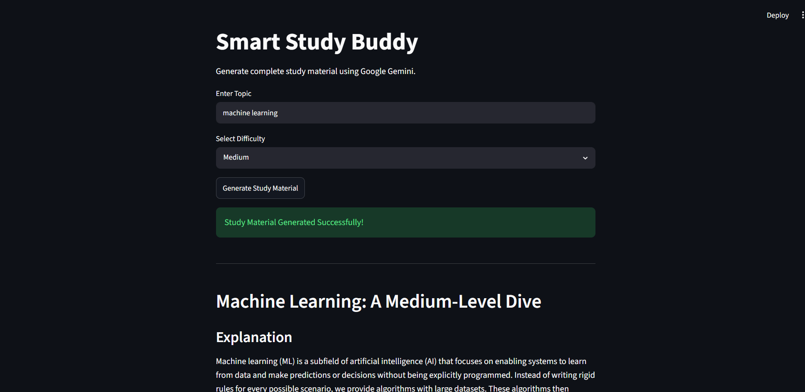
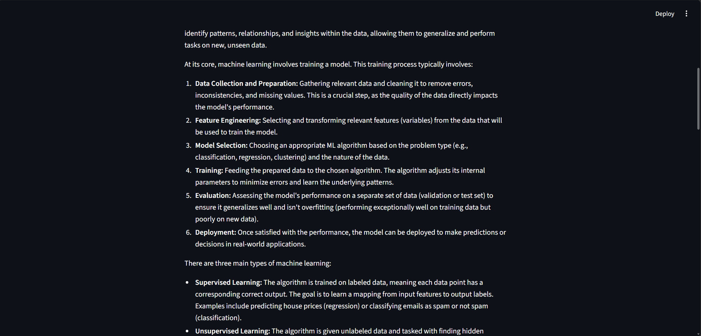
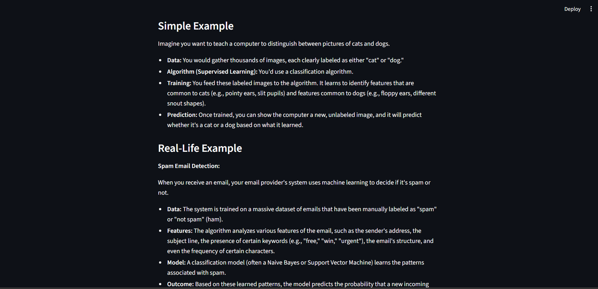
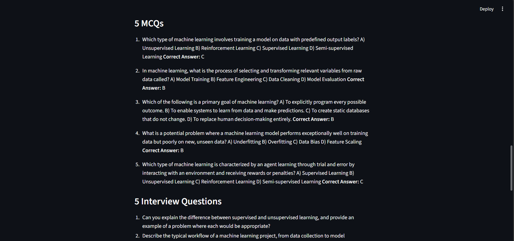
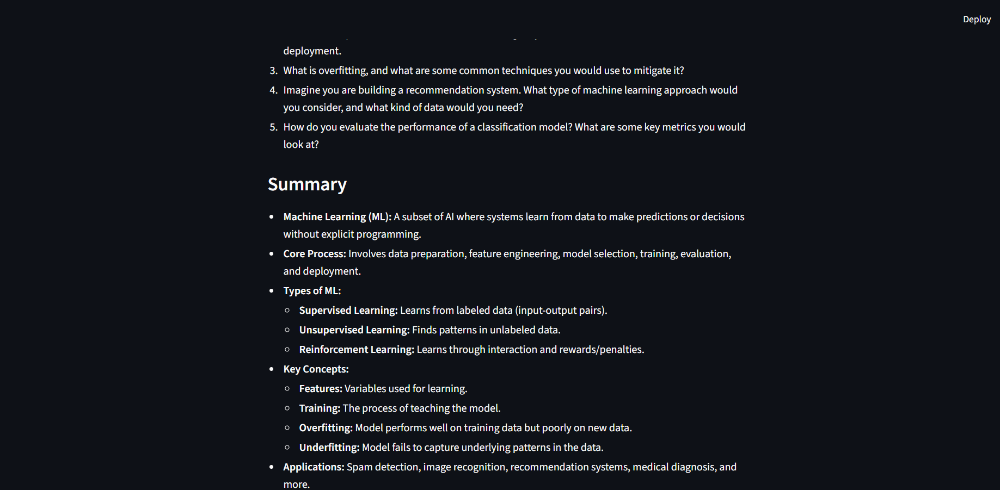

# Smart Study Buddy – AI Powered Study Material Generator

<div align="center">

## 📸 Application Preview

<div align="center">












</div>

---


# Project Overview

**Smart Study Buddy** is an AI-powered educational assistant that automatically generates complete study material using **Google Gemini**, **LangChain**, and **Streamlit**.

Instead of manually searching multiple websites or books, users simply enter a topic and select a difficulty level. The application instantly generates structured study notes including explanations, examples, MCQs, interview questions, and concise summaries.

The project demonstrates the practical implementation of Generative AI, Prompt Engineering, and Large Language Models (LLMs) to improve the learning experience.

---

# Business Problem

Students often spend significant time searching different websites, YouTube videos, blogs, and books to prepare study material for a single topic.

Common challenges include:

- Information scattered across multiple sources
- Time-consuming note preparation
- Lack of structured learning material
- Difficulty preparing interview questions
- Limited practice MCQs
- Inconsistent explanations

This project solves these problems by generating complete learning resources in one place using Generative AI.

---

# Objectives

The project aims to:

- Generate complete study notes using AI
- Support multiple difficulty levels
- Create beginner-friendly explanations
- Provide practical examples
- Generate interview preparation questions
- Generate multiple-choice questions automatically
- Summarize topics into quick revision notes
- Improve learning productivity

---

# Key Features

- AI-powered study material generation
- Google Gemini LLM integration
- Difficulty selection (Easy, Medium, Hard)
- Topic-based content generation
- Detailed explanations
- Simple examples
- Real-world examples
- Automatically generated MCQs
- Interview questions
- Topic summaries
- Clean and responsive Streamlit interface

---

# Application Workflow

### Step 1

User enters a topic.

Example:

```
Machine Learning
```

---

### Step 2

Select the difficulty level.

Options:

- Easy
- Medium
- Hard

---

### Step 3

Click

```
Generate Study Material
```

---

### Step 4

LangChain creates a structured prompt.

---

### Step 5

Prompt is sent to Google Gemini.

---

### Step 6

Gemini generates:

- Explanation
- Simple Example
- Real-Life Example
- 5 MCQs
- 5 Interview Questions
- Summary

---

### Step 7

Results are displayed beautifully in the Streamlit interface.

---

# AI Workflow

```
User
      │
      ▼
Streamlit UI
      │
      ▼
LangChain Prompt
      │
      ▼
Google Gemini API
      │
      ▼
AI Generated Study Material
      │
      ▼
Streamlit Output
```

---

# Prompt Engineering

The application uses LangChain PromptTemplate to instruct Gemini to generate structured educational content.

The prompt asks the model to generate:

- Explanation
- Simple Example
- Real-Life Example
- 5 MCQs
- 5 Interview Questions
- Summary

This ensures consistent and well-organized responses.

---

# Technologies Used

## Programming Language

- Python

## Framework

- Streamlit

## LLM

- Google Gemini

## AI Framework

- LangChain

## Environment Management

- Python Dotenv

---

# Project Structure

```
Smart-Study-Buddy/
│
├── Smart_study_budy.py
├── .env
├── requirements.txt
├── README.md
│
├── Images/
│   ├── ssb1.png
│   ├── ssb2.png
│   ├── ssb3.png
│   ├── ssb4.png
│   └── ssb5.png
│
└── assets/
```

---

# Installation

Clone the repository

```bash
git clone https://github.com/yourusername/Smart-Study-Buddy.git
```

Move into the project directory

```bash
cd Smart-Study-Buddy
```

Install dependencies

```bash
pip install -r requirements.txt
```

Create a `.env` file

```text
GOOGLE_API_KEY=YOUR_API_KEY
```

Run the application

```bash
streamlit run Smart_study_budy.py
```

---

# Example Output

The application generates:

- Detailed topic explanation
- Beginner-friendly examples
- Real-world examples
- Five MCQs with answers
- Five interview questions
- Topic summary

All content is generated dynamically using Google Gemini.

---

# Skills Demonstrated

This project demonstrates practical knowledge of:

- Generative AI
- Large Language Models (LLMs)
- Google Gemini API
- LangChain
- Prompt Engineering
- Streamlit Development
- Python Programming
- AI Application Development
- Environment Variable Management
- User Interface Design

---

# Business Applications

This project can be used for:

- AI Learning Platforms
- EdTech Applications
- Online Coaching
- Student Learning Assistants
- Corporate Training
- Interview Preparation
- AI Tutors
- Educational Chatbots
- Personalized Learning Systems

---

# Future Improvements

- PDF Notes Export
- Quiz Timer
- Voice-based Learning
- Image Generation
- Multi-language Support
- Learning Progress Tracking
- User Authentication
- Chat History
- Dark & Light Themes
- Mobile Responsive Design

---

# Screenshots

### Home Page

`Images/ssb1.png`

---

### Study Material Generated

`Images/ssb2.png`

---

### Examples

`Images/ssb3.png`

---

### MCQs & Interview Questions

`Images/ssb4.png`

---

### Summary

`Images/ssb5.png`

---

# License

This project is developed for educational and portfolio purposes.

---

# Author

## Parth Solanki

**Data Analyst | Machine Learning Engineer | Generative AI Developer**

GitHub: https://github.com/yourusername

LinkedIn: https://linkedin.com/in/yourprofile

---
